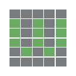

# Wordle Helper

[Wordle](https://www.powerlanguage.co.uk/wordle/) is taking Twitter by storm, so I decided to take this opportunity to make something fun and slightly useful and learn how to make a Chrome extension.

### Setup
You can download the Chrome extension [here](https://chrome.google.com/webstore/detail/wordle-helper/lcoapaclmojlnbjipmpfibcjomncgdod), or you can clone the repo and load it as an [unpacked extension](https://developer.chrome.com/docs/extensions/mv3/getstarted/).

### Usage
The extension will narrow down the possible words based on the game state. Click on the extension to see the count and list of possible answer words remaining. The extension will update as you enter guesses.

https://user-images.githubusercontent.com/6826622/149270872-103e1a2a-3bea-42cd-8289-cd5799da8544.mp4

